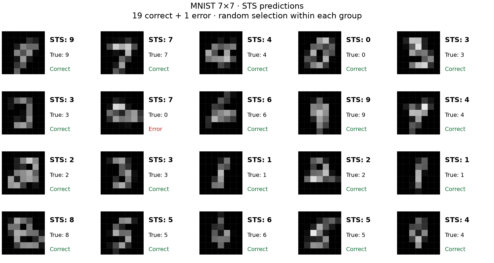
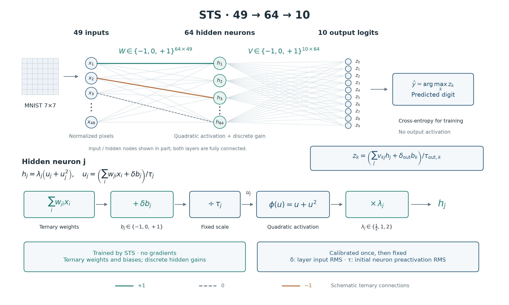
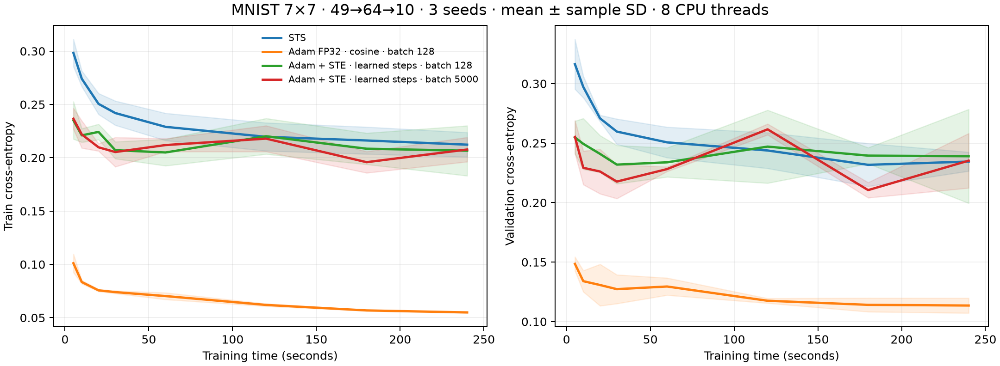
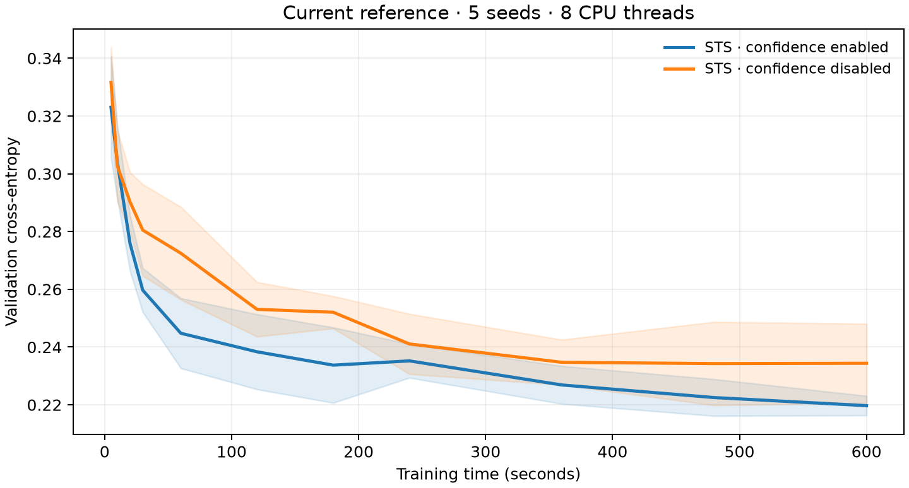

# Stochastic Ternary Search

Gradient-free training of ternary neural networks. This repository contains a small CPU reference implementation and preliminary MNIST 7×7 results.

The project has three goals:

- Explore learning methods that do not use gradients.
- Investigate the capabilities and limitations of ternary neural networks.
- Assess how much can be learned from MNIST images downsampled to just 7×7 pixels.



MNIST images reduced to **7×7 pixels**, with STS predictions and true labels. Illustrative selection: **19 correct classifications and one error**.

## Model and search



Weights and biases belong to `{−1, 0, +1}`. Each hidden neuron has a discrete gain λ in `{½, 1, 2}`. For a hidden neuron:

$$u_j = (\sum_i w_{ji}x_i + \delta b_j)/\tau_j, \qquad h_j = \lambda_j(u_j+u_j^2).$$

The output is linear logits, also divided by fixed per-output calibration constants. Training minimizes cross-entropy directly from those logits. The calibration constants δ and τ are computed once on the training set and remain fixed.

Each round selects K distinct weight positions, using a confidence-weighted distribution, then samples 24 candidate assignments on those positions. Biases and gains can also mutate. Identical networks share an evaluation. The best candidate competes with the current network and a separately evaluated consensus of improving candidates. Only a strict improvement is accepted on the current batch.

K adapts using recent improvement per deterministic estimated computational cost. Confidence uses INT32 counters with sparse INT64 overflow extensions. No gradient or backpropagation is used. See [the algorithm](docs/algorithm.md) for the sampling, confidence and batch rules.

## Run

Requires Linux x86-64 with AVX2, glibc, a C++17 compiler with OpenMP, and Python 3.10+. The current implementation is CPU-only; it supports one hidden layer of width 32, 64 or 128. The reference runs used eight CPU threads and PyTorch 2.14.0+cpu.

```bash
python3 -m venv .venv
source .venv/bin/activate
pip install -e '.[test]'
bash scripts/build_native.sh
pytest -q
python -m sts --width 64 --seed 500 --threads 8 --seconds 600 --output runs/demo
```

MNIST is downloaded and checksum-checked on first use. `--data` selects its cache directory. The output contains metrics, a checkpoint and provenance. For a reproducible round budget, replace the time budget with `--iterations 1024`. Use the same seed, software versions, hardware and thread count when comparing exact trajectories; a time budget stops at different round counts on different machines.

The dataset is reduced by 4×4 average pooling to 7×7, normalized using `(x − 0.1307)/0.3081`, and split into 59,000 training, 1,000 validation and 10,000 test images. Training batches start at 32 examples and grow adaptively. Validation and test labels do not control training.

## MNIST 7×7 comparison

The corrected comparison uses 240-second budgets on an Intel i7-11700 with eight CPU threads, with seeds 500–502. STS uses audited current-reference checkpoints from earlier 600-second runs; Adam/STE confirmations are new. All networks have shape 49→64→10, but their activations and parameterizations differ: STS uses its calibrated quadratic activation and discrete biases/gains, while the baselines use ReLU and floating biases.

The main STE comparator has learned positive row steps and a clipped surrogate gradient, inspired by LSQ and adapted to exactly three weight codes in both layers. It trains from scratch. It is not a reproduction of the paper's full training recipe. Adam uses learning rate 0.003; learned-step STE uses 0.001. Both use an update-based cosine schedule. [Protocol and tuning details](docs/benchmarks.md) explain the differences and limits.

Mean ± sample standard deviation at the end of each run ([individual runs](results/comparison_terminal.csv)):

| Method | Validation cross-entropy | Test accuracy |
|---|---:|---:|
| STS | 0.2345 ± 0.0080 | 94.15 ± 0.26% |
| Adam FP32, batch 128 | 0.1135 ± 0.0063 | 96.98 ± 0.03% |
| Adam + STE, learned steps, batch 128 | 0.2390 ± 0.0395 | 93.43 ± 1.01% |
| Adam + STE, learned steps, batch 5000 | 0.2353 ± 0.0229 | 93.21 ± 0.60% |



Training cross-entropy is evaluated on all 59,000 training images. Curves show every recorded checkpoint from five seconds onward, without smoothing; bands are ±1 sample SD. The STE training loss no longer shows the large late deterioration of the original comparator. Validation still fluctuates, and three seeds support only preliminary conclusions. These experiments compare complete methods with different function classes; they do not isolate the optimizer alone.

A separately confirmed detached-scale STE with reduced learning rate and cosine decay is reported in the [stability review](docs/ste_review.md). The original constant-rate runs remain [archived](docs/historical_v2.md); their poor terminal scores should not be read as a general result about STE. The earlier FP32 constant-rate baseline also remains available there.

To reproduce a learned-step STE confirmation:

```bash
python scripts/benchmark_baselines.py --mode adam_ste --quantizer learned \
  --batch 128 --lr 0.001 --schedule cosine --horizon 288000 \
  --seed 500 --seconds 240 --output runs/ste128
```

Use `--quantizer twn` for the detached-scale control (initial rate 0.0001, horizon 336000 for batch 128 or 168000 for batch 5000). Learned-step batch 5000 uses horizon 144000. Adam FP32 uses `--mode adam --batch 128 --lr 0.003 --schedule cosine --horizon 552000`. The schedule reaches 1% of its initial rate at the specified update count and stays there.

## Current reference

The adopted implementation combines incremental candidate scoring, the V3 scorer and INT32 confidence without forgetting. A separate 600-second comparison used five seeds, 500–504:

| Method | Validation cross-entropy | Test accuracy |
|---|---:|---:|
| STS, confidence enabled | 0.2197 ± 0.0034 | 94.29 ± 0.08% |
| Same search, confidence disabled | 0.2344 ± 0.0137 | 94.06 ± 0.30% |



Confidence lowers the average validation loss across five seeds, but the variation between runs leaves its benefit uncertain.

The standalone implementation reproduces the research reference exactly for 1,024 rounds at each width 32, 64 and 128, including batch sampling, scores, confidence and adaptive batch growth. Tests also cover checkpoint replay and integer overflow. See [validation evidence](results/reference-validation.json).

[CSV results](results/) and [comparison plot generation](scripts/plot_comparison.py) are included. The corrected comparator is executable with the supplied benchmark script; historical drivers used different reporting overhead. No dataset or compiled binary is distributed.

## License

[MIT](LICENSE).
