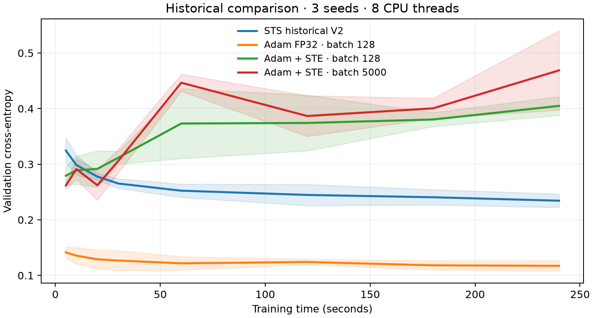

# Historical V2 comparison — superseded unstable STE baseline

This archive is not the current introductory benchmark. The original graph is retained below for provenance.

**These historical results use STS V2 with FP64 confidence, rather than the current reference, whose confidence counters use INT32.** Each run received 240 seconds on an Intel i7-11700 with eight threads, with seeds 500–502. All networks have shape 49→64→10, but their activations and parameterizations differ. Adam and STE use ReLU; STS uses its calibrated quadratic activation. This comparison does not isolate the optimizer alone.

Mean ± sample standard deviation, measured at the end of the run:

| Method | Validation cross-entropy | Test accuracy |
|---|---:|---:|
| STS historical V2 | 0.2344 ± 0.0121 | 93.94 ± 0.26% |
| Adam FP32, batch 128 | 0.1172 ± 0.0094 | 96.78 ± 0.18% |
| Adam + STE, batch 128 | 0.4049 ± 0.0170 | 89.47 ± 0.70% |
| Adam + STE, batch 5000 | 0.4688 ± 0.0713 | 87.79 ± 2.24% |

STE peaked early and then regressed with the tested constant learning rate. Choosing each run's best recorded validation checkpoint gives:

| Method | Selected validation cross-entropy | Test accuracy at selected checkpoint |
|---|---:|---:|
| STS historical V2 | 0.2344 ± 0.0121 | 93.94 ± 0.26% |
| Adam FP32, batch 128 | 0.1130 ± 0.0055 | 96.71 ± 0.16% |
| Adam + STE, batch 128 | 0.2695 ± 0.0099 | 92.15 ± 0.20% |
| Adam + STE, batch 5000 | 0.2506 ± 0.0174 | 92.42 ± 0.75% |

**Baseline under review:** the constant-rate STE runs regress on both training and validation data. This comparison is being replaced after a stability study; the archived measurements below should not be interpreted as evidence against STE.

Adam FP32 is the strongest baseline here. These limited experiments do not establish superiority over well-tuned STE methods. [Benchmark details](benchmarks.md) describe initialization, tuning, checkpoint selection and the different forward parameterizations.
