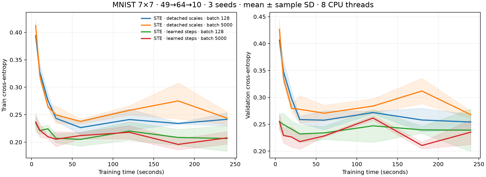

# STE stability review

The original detached-statistics identity STE, trained at constant learning rate 0.001, regressed on both training and validation loss. The independently audited histories are real measurements, not a plotting error. They were an inadequate basis for a broad comparison against STE.

On the original seed 500/batch 128, hidden latent-weight norm rose from 11.18 to 70.55, average quantization scale from 0.234 to 1.390, and relative weight reconstruction error from 33.2% to 74.7%. This supports a diagnosis of quantization/optimization drift; it does not establish a single causal explanation.

## Controls and costs

The study kept the original model, data, CPU/thread count and historical archives intact. Initial pilots used seeds 950/951 and 60 seconds: two STE batch sizes, constant 0.001/0.0001 and cosine 0.001/0.0003, plus Adam 0.003 with cosine decay. Eighteen pilots cost 1080 nominal seconds. A second stage compared the winning STE setting with cosine 0.0001 on the same pilot seeds for the full 240 seconds, eight runs / 1920 seconds. This corrected the original short-horizon tuning mismatch.

A separate learned-step quantizer study used two initial rates (0.001/0.0003), two batches and two pilot seeds for 60 seconds: eight runs / 480 seconds. Total disclosed tuning cost is 3480 seconds (58 minutes), excluding engineering smokes and post-run audits. This was an adaptive engineering search, not a preregistered independent comparison set. No pilot test score was evaluated.

Selected settings were committed before seeds 500–502. Both STE families received six 240-second confirmations; Adam cosine received three. All fifteen confirmations were sequential on the same i7-11700/eight threads, with no competing benchmark jobs. Validation checkpoints 0/5/10/20/30/60/120/180/240 seconds were fixed in advance. The new harness excludes loading, disposable warmup and fresh initialization, includes validation/snapshot overhead, and snapshots replay state every 512 updates rather than 32 in the historical driver. All post-budget train/test computations and artifact writes are excluded.

## Results

Terminal metrics, mean ± sample SD across three seeds:

| Method | Validation cross-entropy | Test accuracy |
|---|---:|---:|
| STS | 0.2345 ± 0.0080 | 94.15 ± 0.26% |
| Adam FP32, batch 128 | 0.1135 ± 0.0063 | 96.98 ± 0.03% |
| Adam + STE, detached scales, batch 128 | 0.2541 ± 0.0146 | 92.45 ± 0.70% |
| Adam + STE, detached scales, batch 5000 | 0.2678 ± 0.0068 | 92.16 ± 0.70% |
| Adam + STE, learned steps, batch 128 | 0.2390 ± 0.0395 | 93.43 ± 1.01% |
| Adam + STE, learned steps, batch 5000 | 0.2353 ± 0.0229 | 93.21 ± 0.60% |

Best recorded validation checkpoints, selected separately per run before test evaluation:

| Method | Selected validation cross-entropy | Test accuracy at selected checkpoint |
|---|---:|---:|
| STS | 0.2297 ± 0.0163 | 94.06 ± 0.12% |
| Adam FP32, batch 128 | 0.1132 ± 0.0061 | 97.01 ± 0.08% |
| Adam + STE, detached scales, batch 128 | 0.2428 ± 0.0074 | 92.89 ± 0.39% |
| Adam + STE, detached scales, batch 5000 | 0.2561 ± 0.0044 | 92.72 ± 0.50% |
| Adam + STE, learned steps, batch 128 | 0.2122 ± 0.0151 | 94.01 ± 0.51% |
| Adam + STE, learned steps, batch 5000 | 0.2072 ± 0.0025 | 93.88 ± 0.34% |

Test never controls learning or hyperparameter/checkpoint selection. The complete terminal, selected and pilot tables remain in results/. Validation uses only 1000 examples and the same validation set was used for tuning, so independent test scores and variation across seeds matter. Neither a smooth-looking mean nor one winning seed establishes general superiority.

One detached-scale batch-5000 confirmation (seed 500) completed 123,423 updates, versus 198,858 and 203,928 for the other seeds. Its throughput dropped after roughly 20 seconds; the cause was not isolated. Consequently its fixed update schedule did not reach the floor within 240 seconds. The run is retained, and actual update counts and rates are exported; no equal-update or kernel-speed claim is made from this comparison. The learned-step and FP32 confirmations had much smaller throughput variation.

## Learned-step quantizer

For each weight row, a positive FP32 step s gives q=round(clip(w/s,−1,1)) and forward weight=sq. Biases remain FP32. Both weight layers use exactly three codes; neither layer is left floating point. Activations remain FP32 ReLU.

The weight surrogate derivative is 1 inside −1<w/s<1 and 0 outside, including endpoints. The step derivative is (q−w/s)/sqrt(row fan-in) inside and q/sqrt(row fan-in) outside. Steps start at twice the row mean of abs(w) and are projected to at least 1e−6 after each update. This follows the gradient/normalization idea in [Learned Step Size Quantization](https://arxiv.org/abs/1902.08153), adapted to symmetric ternary, row-wise scales, Adam and from-scratch training; it omits the paper's pretrained initialization, activation quantization and higher-precision first/last layers.

There are 3924 latent trainable parameters (3776 weights, 74 biases, 74 steps), versus 3850 for the original detached-scale model and 3914 discrete variables for STS. The ideal packed inference payload is unchanged from the original STE convention: 1536 bytes for two-bit codes plus FP32 row scales/biases. Actual training and serialization use ordinary tensors and are not two-bit packed.

Learning the scale, changing the surrogate, reducing the rate and adding learning-rate decay are distinct interventions. The main comparator is deliberately labeled learned-step STE; these data do not isolate which intervention accounts for every improvement, nor prove optimal hyperparameters. Remaining quantization fluctuations are visible rather than hidden by taking a cumulative best curve.

## Audit and reproduction

Every run passed independent source/data hash checks, finite-history/checkpoint checks, full-training/validation metric recomputation from independently reconstructed inference weights, inference export checks and exact final-block replay. Raw checkpoints/histories remain in the private research archive; public CSVs and source hashes are supplied without dataset copies or internal paths. STS 240-second states were independently recomputed from audited current-reference checkpoints; no new STS training was needed.

The public learned-step implementation also matches the research comparator exactly for 16 updates on deterministic random inputs, with matching losses and model states; see [port validation](../results/baseline-port-validation.json).

Use the README benchmark commands. To regenerate the introductory and diagnostic curves: `python scripts/plot_comparison.py`. This requires the plots extra. Frozen schedules use update counts, not live timing; actual updates and elapsed durations are recorded in comparison_terminal.csv.
